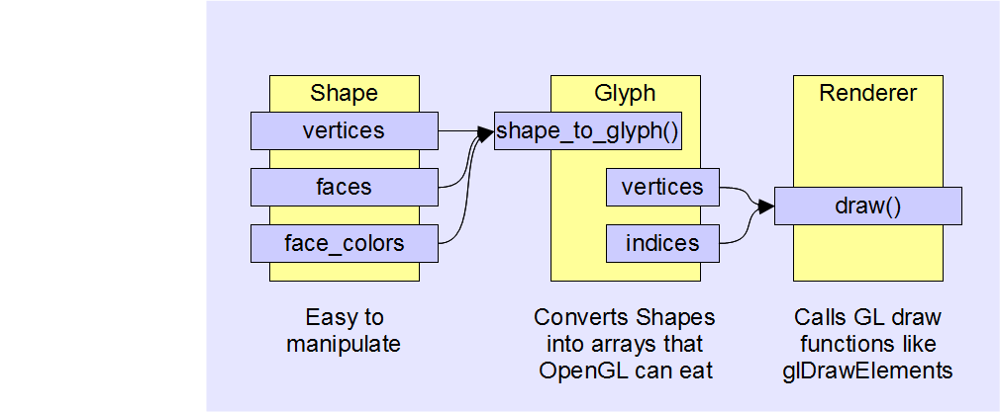
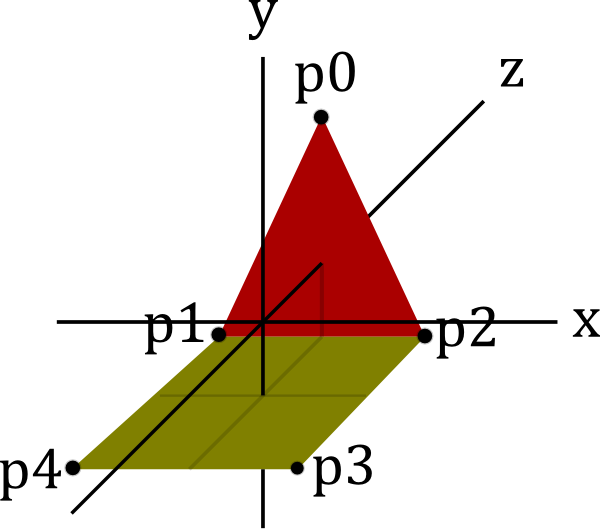
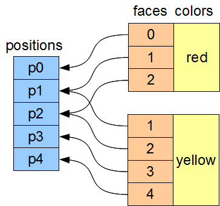
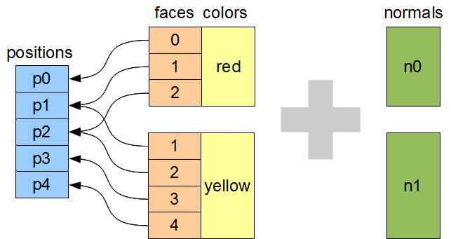
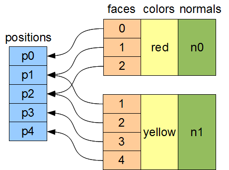
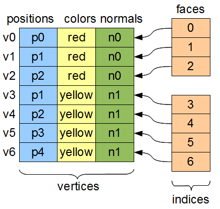
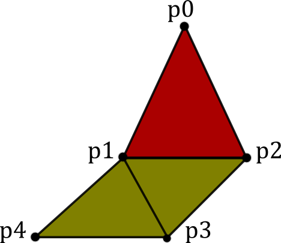
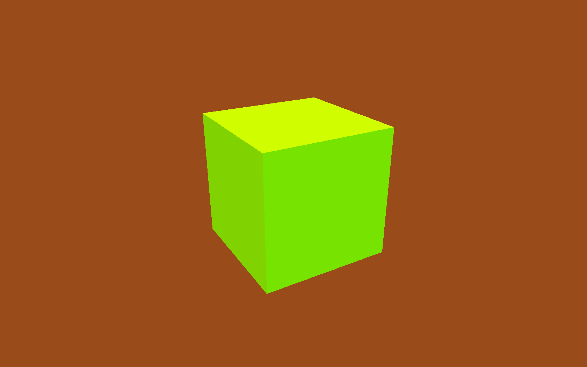

=========================================
Algorithmic Generation of OpenGL Geometry
=========================================

----------------
Jonathan Hartley
----------------

This presentation:
  https://bitbucket.org/tartley/algorithmic-generation-of-geometry

Code:
  https://bitbucket.org/tartley/gloopy

Starting Point
--------------

The minimum viable OpenGL application:

* Open a window which provides an OpenGL context
* Call an empty 'draw' function at 60fps

Could use pyglet or PyGame or wxPython or GLUT or Qt.

.. class:: handout

    I'm assuming we're starting with a minimal OpenGL application.

    By which I mean open a window, and redraw a blank screen at 60fps.
    I think I can actually show you a demo of that...
    
    I'm using pyglet to do this, but you could use a bunch of different
    libraries. Whichever one you use, there are lots of tutorials about getting
    this up and running, so 'getting started' isn't what I want to talk about.

    The idea of this talk is that I want to show some code you can add on top
    of this minimal OpenGL loop in order to create some funky virtual scultures
    and animations.
    
    I want to demonstrate that producing chunky retro graphics is easy, and can
    be done with with a surprisingly small amount of code. I want you to leave
    here enthused to generate your own virtual sculptures or animations or
    games.

Goal
----

.. class:: handout

    To begin with, I'm going to lead you as quickly as I can through a couple
    of classes that take some shapes defined in a useful way, and convert them
    in to OpenGL calls.

Goal
----

.. image:: images/fun-stuff.png
    :width: 900

.. class:: handout

    The point of all this, though, is that once that infrastructure is in
    place, we can have some fun generating interesting shapes to make
    pretty pictures with. In particular, I'm interested in how we can maximise
    our fun with a minimum amount of code.

Shape class
-----------

.. sourcecode:: python

    Color = namedtuple('Color', 'r g b a')

    class Shape(object):

      def __init__(self, verts, faces, colors):
        # list of Vec3s
        self.vertices = verts

        # list of faces, each face is a list of
        # indices into 'vertices'
        self.faces = faces

        # List of Colors, one per face
        self.face_colors = colors

.. class:: handout

    A polyhedron is a 3D shape with flat faces and straight edges. This class
    models one, with a color for each face.

Simple Example
--------------

Instance of Shape
-----------------

.. sourcecode:: python

        shape = Shape(
            vertices=[
                #     x   y   z
                Vec3( 0,  2,  1), # p0
                Vec3(-1,  0,  1), # p1
                Vec3( 1,  0,  1), # p2
                Vec3( 1,  0, -1), # p3
                Vec3(-1,  0, -1), # p4
            ],
            faces=[
                [0, 1, 2],    # triangle
                [1, 2, 3, 4], # square
            ],
            face_colors=[Color.Red, Color.Yellow],
        )

.. class:: handout

    A simple example is a geometry consisting of a triangle joined to a square.

    We create a list of vertex positions (remember these are just named tuples)
    and then a list of faces. Each face is just a list of integers, indexes
    into the vertex list.

    Instantiating our Shape class like this is great to represent the geometry
    for ourselves, but we can't pass this data to OpenGL. There are a few
    operations we have to do to it first.

Diagram of our Shape instance
-----------------------------

Step 1: Calculate face normals
------------------------------

Step 1: Calculate face normals
------------------------------

.. sourcecode:: python

    def get_normal(positions, face):
        '''
        Return the face's unit normal vector.
        '''
        v0 = positions[face[0]]
        v1 = positions[face[1]]
        v2 = positions[face[2]]
        a = v0 - v1
        b = v2 - v1
        return b.cross(a).normalized()

.. class:: handout

    Firstly, we have to calculate the normals for each face. This is easy
    enough - we take the first three vertices of the face, look up their
    positions. v0 to v1 is one vector, v2 to v1 is another. Since they both
    must lie in the plane of the face, their cross-product must be orthogonal
    to the face. We normalise the length, and this is our face normal.

    I've been telling you that my Vec3 class is just a named tuple - I should
    confess at this point that it started to sprout a few methods. Obviously
    here I'm using vector subtraction and the '.cross' method. By
    the end of this exercise I'd written my own fully-formed vector and matrix
    classes. One day I ripped them out and replaced them with PyEuclid. It
    halved the size of my code. Should have done that from the start.

After creating normals
----------------------

Step 2: Denormalise vertices
----------------------------

.. image:: images/denormalise-vertices.png

.. class:: handout

   On the left, we have the structure that our Shape class provides.
   We need to denormalise the color information - we need to copy the color
   entries onto each individual vertex.
   
   Some vertex positions are referenced by more than one color. These
   vertex positions need duplicating, so that we can have one entry for
   each color.

   See how vertex positions p1 and p2 have been duplicated on the right.
   
   As shapes get more complex, this will become more and more
   common. In general, every vertex will have at least three duplicates like
   this. (think of a single corner of a cube - the vertex participates in
   three different faces, each with different colors or other attributes)

   When we duplicate vertex positions like this, we also need to update the
   indexes that make up the face. See how the indices for the square face,
   in the bottom-left, are now totally different than they were originally. 
   

Step 2: Denormalise vertices
----------------------------

.. sourcecode:: python

    def shape_to_glyph(positions, faces, colors):
        vertices = []
        for face, color in zip(faces, colors):
            new_indices = {}
            for old_index in face:
              new_indices[old_index] = len(vertices)
              vertex = chain(
                  positions[old_index],
                  color,
                  get_normal(positions, face)
              )
              vertices.append(vertex)

              # cont...

.. class:: handout

    x

Step 2: Denormalise vertices
----------------------------

.. sourcecode:: python

    def shape_to_glyph(positions, faces, colors):
        indices = []
        for face, color in zip(faces, colors):

            # ...cont

            for old_index in tessellate(face):
                indices.append(
                    new_indices[old_index]
                )

.. class:: handout

    x

After Denormalising
-------------------

.. class:: handout

    x

Step 3: Tessellate
------------------

.. class:: handout

    When I say tessellate, I just mean break each polygon into triangles.
    You don't have to do this, necessarily. OpenGL will accept other primitive
    types. But I send geometry as GL_TRIANGLES because it makes it easy
    to render discontinuous shapes in a single draw call.

    There are well-known algorithms to do this for arbitrary polygons. An
    implementation using the GLU library takes about 150 lines of Python.

Step 3: Tessellate
------------------

.. image:: images/tessellation.png

.. class:: handout
    
    However, a really simple alternative is to just take vertex zero (or any
    arbitrary vertex) and join it up to all the other vertices in the face.

Step 3: Tessellate
------------------

.. sourcecode:: python

    def tessellate(face):
        '''
        Break the given face into triangles.
        e.g. [0, 1, 2, 3, 4] ->
             [[0, 1, 2], [0, 2, 3], [0, 3, 4]]
        Does not work on concave faces.
        '''
        return (
            [face[0], face[i], face[i + 1]]
            for i in xrange(1, len(face) - 1)
        )

.. class:: handout

    This poor-man's tessellation won't work with concave faces. But in the
    interests of simplicity, lets run with this for the time being and see
    how far it gets us.

After tessellation
------------------

.. image:: images/after-tessellation.png

.. class:: handout

    x

Step 4: Flatten, ctypes, bind
-----------------------------

.. sourcecode:: python

    vertices = [
        (x, y, z,  r, g, b, a,  x, y, z), # v0
        (x, y, z,  r, g, b, a,  x, y, z), # v1
        (x, y, z,  r, g, b, a,  x, y, z), # v2
        # etc...
    ]
    indices = [0, 1, 2,  3, 4, 5,  5, 4, 6]

- Put into ctypes arrays
- Bind them to OpenGL VBOs (optional)

.. class:: handout

    So this is the final state of our data.

    Next these get put into ctypes arrays, optionally put into a VBO, and
    optionally then associated with a VAO. This is all boilerplate OpenGL
    stuff, so I won't cover it.

Step 5: Render
--------------

.. sourcecode:: python

    def draw(self, vao, indices):
        glBindVertexArray(vao)
        glDrawElements(
            GL_TRIANGLES,
            len(indices),
            GL_UNSIGNED_SHORT,
            indices
        )

.. class:: handout

   Everything up to this point can be done once, at application start-up,
   or when the geometry is created.
   This is the only step that needs doing every frame.

First Light
-----------

.. image:: images/screen-triangle-square.png
    :width: 900
    :height: 600

.. class:: handout

    So. It's been a bit of a slog to get here, but finally, we now in a
    position to run this code and get some visuals out.

Shape Factories
---------------

Now let's use our infrastructure for some fun!

.. sourcecode:: python

    def Tetrahedron(edge, face_colors):
        size = edge / sqrt(2)/2
        verts = [
            (+size, +size, +size),   # v0
            (-size, -size, +size),   # v1
            (-size, +size, -size),   # v2
            (+size, -size, -size), ] # v3
        faces = [
            [0, 2, 1],  # f0
            [1, 3, 0],  # f1
            [2, 3, 1],  # f2
            [0, 3, 2] ] # f3
        return Shape(verts, faces, face_colors)

Tetrahedron
-----------

.. image:: images/screen-tetrahedron.png
    :width: 900
    :height: 600

Cube
----

.. sourcecode:: python

    def Cube(edge, face_colors=None):
        e2 = edge/2
        verts = list(
            product(* repeat([-e2, +e2], 3) )
        )
        faces = [
            [0, 1, 3, 2], # left
            [4, 6, 7, 5], # right
            [7, 3, 1, 5], # front
            [0, 2, 6, 4], # back
            [3, 7, 6, 2], # top
            [1, 0, 4, 5], # bottom
        ]
        return Shape(verts, faces, face_colors)

.. class:: handout

    Here we see the eight vertices of a cube, and its six faces.

Demo Cube & Others
------------------

.. class:: handout

    Tetrahedron, Cube, Octahedron, Dodecahedron, Icosahedron (Platonic)
    DualTetrahedron & combinations of all the above.
    Space Station.

Shapes as an attribute of GameItems
-----------------------------------

.. sourcecode:: python

    class GameItem(object):
        def __init__(self, ** kwargs):
            self.__dict__.update(** kwargs)

    world.add( GameItem(
        shape=Cube(1, repeat(Color.Red)),
        position=Vector(1, 2, 3),
    ) )

.. class:: handout

    An 'item' is the term I use for a single
    drawable object. Items have a position, an orientation, and a glyph,
    which is what I call the collection of arrays that OpenGL uses to draw
    something.

    Items don't have any functionality - they are just a dumb collection of
    attributes.

Rendering Multiple Items
------------------------

.. sourcecode:: python

    def draw(self, world):
        for item in world.items:
            glPushMatrix()
            glMultMatrixf(item.transform)
            glBindVertexArray(item.glyph.vao)
            glDrawElements(
                GL_TRIANGLES,
                len(item.glyph.indices),
                GL_UNSIGNED_SHORT,
                item.glyph.indices
            )
            glPopMatrix()
        glBindVertexArray(0)

.. class:: handout

    So here's our draw function, that gets called every frame. It's very simple
    and minimal, but it's all you need. Everything you see today is drawn by
    this inner loop.

    We're iterate through all the items. The push and mult matrix
    calls are to tell OpenGL about the position and orientation of the item
    we're about to render. The item.transform property is a 4x4 matrix that
    represents the combination of the item's position and orientation.
    
    Messing with the modelview matrix like this is the traditional old OpenGL
    way of doing this - all the cool kids are passing item.transform into their
    shaders instead these days, we don't care for now, it has the same effect.

    Next we bind a vertex array. This is telling OpenGL where the data is
    that we want to draw. We'll take a look at that in a second,

    Then finally, we call DrawElements, which actually draws our object.

Moving Shapes
-------------

.. sourcecode:: python

    class Orbit(object):

        def __init__(self, distance, speed, phase=None):
            self.distance = distance
            self.speed = speed
            if phase is None:
                phase = uniform(0, 2 * pi)
            self.phase = phase

        def __call__(self, item, time):
            bearing = time * self.speed + self.phase
            x = self.distance * sin(bearing)
            z = self.distance * cos(bearing)
            item.position = Vec3(x, 0, z)

.. class:: handout

    I've already sneakily added a class to move items around in the world, I'm
    currently using it to move the camera around. We can add an instance of
    this or similar classes to any item. If it's attached as the item's 'update'
    attribute, then it will be called between screen refreshes, to move the
    item around in the world, or spin it.

    Here we see an example of 'orbit', which will orbit the origin. You
    can imagine more complex behaviours, the one I attached to the camera
    is called WobblyOrbit

Using a Mover
-------------

.. sourcecode:: python

    world.add( GameItem(
        shape=Cube(1, repeat(Color.Red)),
        update=Orbit(distance=20, speed=4),
    ) )

    # then, in world.update():
    for item in self.items:
        if item.update:
            item.update(item, self.time)
   
Demo of movers

TODO: create this demo

.. class:: handout

    Create some sorts of mover

Composite shapes
----------------

.. sourcecode:: python

    class MultiShape(object):

        def __init__(self):
            self.children = []
            self.matrices = []

        def add(self, child, pos=None, orient=None):
            self.children.append(child)
            self.matrices.append(Matrix(pos, orient))

.. class:: handout

    So this is all well and good, but to create complex shapes this way is
    quite tedious. In addition, rendering each shape independantly, using a
    distinct call to glDrawArrays for each Shape, gets very slow after a few
    hundred shapes are added. What we really need is a way to compose new
    shapes out of combinations of the existing ones.

    Introducing MultiShape, the composite shape. As you can see, this is a
    really simple class, it just contains a collection of child shapes,
    and a parallel collection of matrices. These matrices represent the
    transformation that should be applied to each child shape. For example,
    a 'Car' multishape could contain four references to a single 'wheel'
    child shape, but each wheel would have a different offset applied relative
    to the centre of the car.
    
    
Generating MultiShape Vertices
------------------------------

Class MultiShape continued...

.. sourcecode:: python

    @property
    def vertices(self):
      return (
        matrix.transform(vertex)
        for idx, matrix in enumerate(self.matrices)
        for vertex in self.children[idx].vertices
      )

.. class:: handout

    If MultiShape is going to be useable wherever Shape is useable, it has to
    provide the same interface. Luckily Shape's interface is very simple,
    consisting just of collections for vertices, faces and face_colors.
    Here we see how multishape provides a sequence of vertices, by
    applying the relevant matrix transformation to each of its child shapes.

    Similar properties can be added to MultiShape to expose collections of
    faces and face_colors, by aggregating those of its child Shapes.
    

Class Diagram
-------------

.. image:: images/class-diagram.png
    :width: 927
    :height: 266

Demo Some Composite Shapes
--------------------------

Ring, TriAxisRings, CubeGlob, RgbCubeCluster

Using Composite Shapes
----------------------

.. sourcecode:: python

    def RgbCubeCluster(edge, edge, cube_count):
        cluster = MultiShape()
        for _ in xrange(cube_count):
            pos = Vec3(
                randint(-edge/2, +edge/2),
                randint(-edge/2, +edge/2),
                randint(-edge/2, +edge/2),
            )
            color = (pos + edge/2) / edge * 255
            cluster.add(
                Cube(edge, repeat(color)),
                position=Vec3(* pos)
            )
        return cluster

Algorithmic manipulation
------------------------

Demo: Subdivision, Normalization, Stellation, Extrusion, Koche Tetrahedron

EOF
---

PyWeek:
    Make a Python game in a week competition
    Starts midnight at start of Sunday 2011/04/03
    http://pyweek.org

This presentation:
  https://bitbucket.org/tartley/algorithmic-generation-of-geometry

Code:
  https://bitbucket.org/tartley/gloopy

